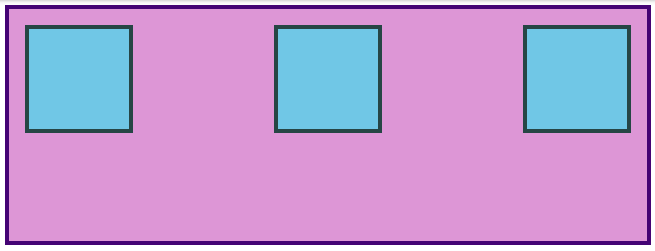

# Alignment

- [The page on TOP](https://www.theodinproject.com/lessons/foundations-alignment)

## Foundations Course

---

## Introduction

So far everything we’ve touched with flexbox has used the rule `flex: 1` on all flex items, which makes the items grow or shrink equally to fill all of the available space. Very often, however, this is not the desired effect. Flex is also very useful for arranging items that have a specific size.

---

## Lesson Overview

This section contains a general overview of topics that you will learn in this lesson.

- You’ll learn how to align items inside a flex container both vertically and horizontally.

---

## Alignment

Let’s look at an example.

You should be able to predict what happens if you put `flex: 1` on the `.item` by now. Give it a shot before we move on!

Adding `flex: 1` to `.item` makes each of the items grow to fill the available space, but what if we wanted them to stay the same width, but distribute themselves differently inside the container? We can do this!

Remove `flex: 1` from `.item` and add `justify-content: space-between` to `.container`. Doing so should give you something like this:

_space between_

`justify-content` aligns items across the main axis. There are a few values that you can use here. You’ll learn the rest of them in the reading assignments, but for now try changing it to `center`, which should center the boxes along the main axis.

To change the placement of items along the cross axis use `align-items`. Try getting the boxes to the center of the container by adding `align-items: center` to `.container`. The desired result looks like this:

_centered_

Because `justify-content` and `align-items` are based on the main and cross axis of your container, their behavior changes when you change the `flex-direction` of a flex-container. For example, when you change `flex-direction` to column, `justify-content` aligns vertically and `align-items` aligns horizontally. The most common behavior, however, is the default, i.e. `justify-content` aligns items horizontally (because the main axis defaults to horizontal), and `align-items` aligns them vertically. One of the biggest sticking points that beginners have with flexbox is confusion when this behavior changes.

---

## Gap

One very useful feature of flex is the `gap` property. Setting `gap` on a flex container adds a specified space between flex items, similar to adding a margin to the items themselves. `gap` is a new property so it doesn’t show up in many resources yet, but it works reliably in all modern browsers, so it is safe to use and very handy! Adding `gap: 8px` to the centered example above produces the result below.

---

There’s more for you to learn in the reading below, but at this point you can surely see how immensely useful flexbox is. With just the properties we’ve already covered, you could already put together some impressive layouts!

Take your time going through the reading. There will be some review of the items we’ve already covered here, but it goes into more depth and touches on a few things that haven’t been mentioned yet. Don’t stress too much about trying to memorize every little detail yet; just code along with the examples and do your best to internalize everything that is possible with flexbox. You’ll have to reach for these resources again once you get to the practice exercises, but that’s perfectly acceptable. The more you use this stuff the better it will stick in your mind… and you will be using it constantly. Have fun!

---

## Assignment

- [Interactive Guide to Flexbox](https://www.joshwcomeau.com/css/interactive-guide-to-flexbox/) — covers everything you need to know. It will help reinforce concepts we’ve already touched on with some really fun and creative examples. Spend some time here, some of it should be review at this point, but the foundations here are important!
- [Typical use cases of Flexbox (MDN)](https://developer.mozilla.org/en-US/docs/Web/CSS/CSS_flexible_box_layout/Typical_use_cases_of_flexbox) — covers some more practical tips. Don’t skip the interactive sections! Playing around with this stuff is how you learn it!
- [CSS Tricks “Guide to Flexbox”](https://css-tricks.com/snippets/css/a-guide-to-flexbox/) — a classic. The images and examples are super helpful. It would be a good idea to review parts 1-3 and part 5 (don’t worry about the media query parts, we will cover them later in the course) and then bookmark it as a great cheat sheet for future reference (keep it handy for the practice exercises).
- Do the exercises in our CSS exercises repository’s `foundations/flex` directory (remember that the instructions are in the README) in the order:
  - 01-flex-center
  - 02-flex-header
  - 03-flex-header-2
  - 04-flex-information
  - 05-flex-modal
  - 06-flex-layout
  - 07-flex-layout-2

Note: Solutions for these exercises can be found in the solution folder of each exercise.

---

## Knowledge Check

The following questions are an opportunity to reflect on key topics in this lesson. If you can’t answer a question, click on it to review the material, but keep in mind you are not expected to memorize or master this knowledge.

- What is the difference between justify-content and align-items?
- How do you use flexbox to completely center a div inside a flex container?
- What’s the difference between `justify-content: space-between` and `justify-content: space-around`?

---

## Additional Resources

This section contains helpful links to related content. It isn’t required, so consider it supplemental.

- [Flexbox Froggy](https://flexboxfroggy.com/) — a funny little game for practicing moving things around with flexbox.
- [Flexbox Zombies](https://mastery.games/p/flexbox-zombies) — another gamified take on flexbox. Free, but requires an account.
- [The Basic Concepts of Flexbox (MDN)](https://developer.mozilla.org/en-US/docs/Web/CSS/CSS_flexible_box_layout/Basic_Concepts_of_Flexbox) — another good starting point. There are helpful examples and interactive sections.
- [Aligning Items in a Flex Container (MDN)](https://developer.mozilla.org/en-US/docs/Web/CSS/CSS_flexible_box_layout/Aligning_Items_in_a_Flex_Container) — goes into more depth on the topic of axes and align-items vs justify-content.
- [Flexbox Tutorial (freeCodeCamp)](https://www.freecodecamp.org/news/flexbox-the-ultimate-css-flex-cheatsheet/) — another decent resource.
- [Flexbox Crash Course (Traversy Media)](https://www.youtube.com/watch?v=JJSoEo8JSnc) — a nice resource by Traversy Media.
- [Scrim on the justify-content property (Scrimba login required)](https://scrimba.com/learn/flexbox)
- [Scrim on the align-items property (Scrimba login required)](https://scrimba.com/learn/flexbox)
