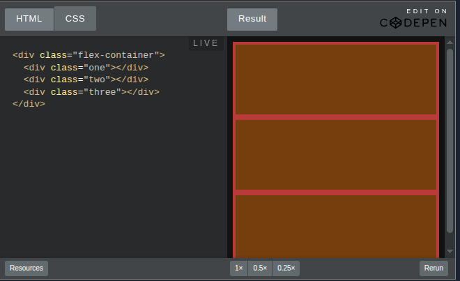
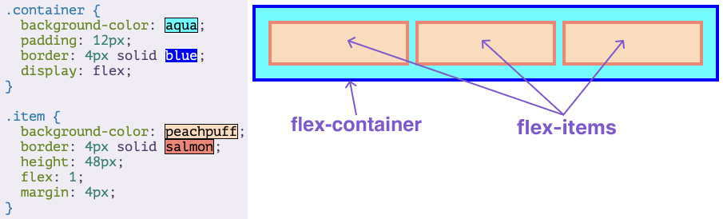
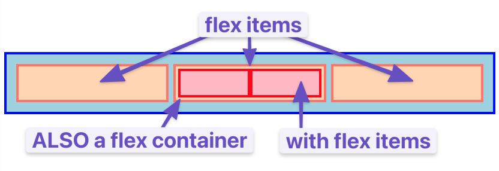
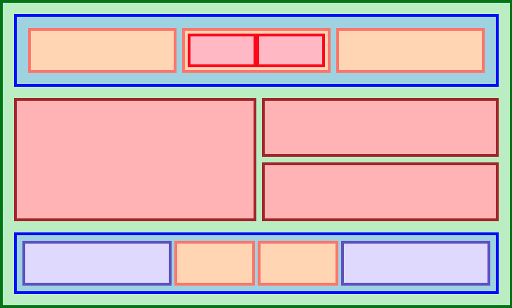

# Introduction to Flexbox

## Foundations Course

---

## Introduction

As you’ll learn, there are many ways to move elements around on a web page. New methods have been developed over the years and older things have fallen out of style. Flexbox was not always available in CSS—its debut was revolutionary. [Learn more about the history of flexbox.](#)

Many resources put it near the end of their curriculum because it is somewhat new as a technology. But at this point, it has become the default way of positioning elements for many developers. Flexbox will be one of the most used tools in your toolbox, so why not learn it first?

---

## Lesson Overview

This section contains a general overview of topics that you will learn in this lesson:

- How to position elements using flexbox
- Flex containers and flex items
- How to create useful components and layouts that go beyond just stacking and centering items

---

## Before We Get Started

Flexbox layouts can get a little complicated. In a previous lesson, you learned how to inspect and debug things using your browser’s developer tools. Those tools will be crucial for you in the following lessons. If something isn’t behaving the way you expect, inspecting it in the developer tools should be your first step every time.

Flexbox isn’t necessarily any more difficult than the other concepts that we’ve covered so far, but it does have a few more moving parts. It is going to be somewhat difficult to make use of any of the things you’re learning in these first lessons until you get to the end and can put it all together. As we go, do yourself a favor and play with all of the code examples.

You will almost definitely need to come back and reference these lessons (or a couple of the resources we share with you) when you get to the assignments at the end of the section, but if you take your time and experiment with all the code examples we provide, you’ll know better where to look when that time comes.

---

## Let’s Flex!

Flexbox is a way to arrange items into rows or columns. These items will _flex_ (i.e. grow or shrink) based on some rules that you can define. To get started, let’s look at a demonstration.

We’ve embedded a lot of interactive examples in these lessons. Take your time to experiment with them as you go to cement the concepts in your mind!

> We’ll get into exactly what’s going on here soon enough. But for now, let’s uncomment the two flex related CSS declarations in the above Codepen by removing the `/*` and `*/` tags surrounding them, then check out the result.
>
> Comments prevent the browser from interpreting lines as code, and are wrapped between specific tags. CSS uses `/*` as an opening comment tag and `*/` as a closing comment tag, while HTML and JavaScript have their own syntax. Commented out lines of code can be ‘re-enabled’ by removing the comment tags surrounding the code.

All 3 divs should now be arranged horizontally. If you resize the results frame with the “1x”, “.5x” and “.25x” buttons you’ll also see that the divs will ‘flex’. They will fill the available area and will each have equal width.

If you add another div to the HTML, inside of `.flex-container`, it will show up alongside the others, and everything will flex to fit within the available area.

If it’s hard to see what’s going on in the small embedded CodePen, feel free to click the “Edit on CodePen” or “Fork on CodePen” button. This will bring the example into a full-sized environment. Some of the later examples might especially benefit from doing this.

---

## Flex Containers and Flex Items

As you’ve seen, flexbox is not just a single CSS property but a whole toolbox of properties that you can use to put things where you need them. Some of these properties belong on the flex container, while some go on the flex items. This is an important concept.

A **flex container** is any element that has `display: flex` on it. A **flex item** is any element that lives directly inside of a flex container.

Somewhat confusingly, any element can be both a flex container and a flex item. Said another way, you can also put `display: flex` on a flex item and then use flexbox to arrange its children.

Creating and nesting multiple flex containers and items is the primary way we will be building up complex layouts. The following image was achieved using only flexbox to arrange, size, and place the various elements. Flexbox is a very powerful tool.

---

## Knowledge Check

The following questions are an opportunity to reflect on key topics in this lesson. If you can’t answer a question, click on it to review the material, but keep in mind you are not expected to memorize or master this knowledge.

- What’s the difference between a flex container and a flex item?
- How do you create a flex item?

---

## Additional Resources

This section contains helpful links to related content. It isn’t required, so consider it supplemental.

- [Interneting Is Hard: Modern CSS Layouts with Flexbox](https://internetingishard.netlify.app/html-and-css/flexbox/index.html)
- [Slaying the Dragon: Flexbox in 8 Minutes](https://flexbox.io/)
- [Scrim on Flexbox (requires Scrimba login)](https://scrimba.com/learn/flexbox)
