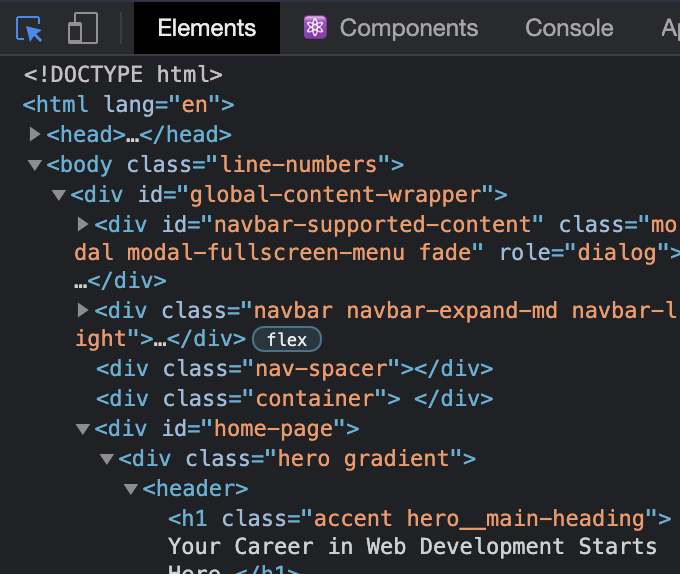

# Inspecting HTML and CSS

## Table of Contents

- [Introduction](#introduction)
- [Lesson Overview](#lesson-overview)
- [The Inspector](#the-inspector)
- [Inspecting Elements](#inspecting-elements)
- [Testing Styles in the Inspector](#testing-styles-in-the-inspector)
- [Assignment](#assignment)
- [Knowledge Check](#knowledge-check)
- [Additional Resources](#additional-resources)

## Introduction

Being able to inspect and debug your HTML and CSS is critical for frontend development. This lesson will take us through the Chrome Dev Tools, which allow you to see detailed information about your elements and CSS rules, as well as assist you in finding and fixing problems in your code.

## Lesson Overview

This section contains a general overview of topics that you will learn in this lesson.

- You will know how to access the element inspector.
- You will know how to select and inspect specific elements.
- You will know how to test out HTML and CSS in the inspector.

---

## The Inspector

To open up the inspector, you can right-click on any element of a webpage and click “Inspect” or press F12. Go ahead and do that right now to see the HTML and CSS used on this page.

Don’t get overwhelmed with all the tools you’re now seeing! For this lesson, we want to focus on the Elements and Styles panels.

---

## Inspecting Elements

In the Elements panel, you can see the entire HTML structure of your page. You can click on any of the elements in this panel to select that specific element. Alternatively, you can click the blue-highlighted icon shown below on the left, and hover over any element on the page.

_Inspector Icon_

When an element is selected, the Styles tab will show all the currently applied styles, as well as any styles that are being overwritten (indicated by a strikethrough of the text). For example, if you use the inspector to click on the “Your Career in Web Development Starts Here” header on the TOP homepage, on the right-hand side you’ll see all the styles that are currently affecting the element, as seen below:

_Overwritten style_

---

## Testing Styles in the Inspector

The Styles panel also allows you to edit styles directly in the browser. You can click inside of any individual selector to add a new rule or click on an existing attribute or value to alter it. When doing so, the webpage responds with the changes in real-time. This won’t affect the source code in your text editor, but it is extremely useful for quickly testing out various attributes and values without needing to reload the page over and over again.

---

## Assignment

Go through the following sections of the official Chrome DevTools docs:

- [Devtools overview](https://developer.chrome.com/docs/devtools/overview/): don’t navigate to any other pages linked here; just get familiar with what tools are available in the DevTools, rather than how to use all of them right now.
- [Open Chrome DevTools](https://developer.chrome.com/docs/devtools/open/): similar to what we went over above, but with some nice extras.
- [Get Started With Viewing And Changing The DOM](https://developer.chrome.com/docs/devtools/dom/): skip through any part that uses the JavaScript console.
- [View and change CSS](https://developer.chrome.com/docs/devtools/css/): be sure to follow along with any interactive instructions!

---

## Knowledge Check

The following questions are an opportunity to reflect on key topics in this lesson. If you can’t answer a question, click on it to review the material, but keep in mind you are not expected to memorize or master this knowledge.

- How do you select a specific element on your page with your browser’s developer tools?
- What does a strikethrough in a CSS declaration mean in your browser’s developer tools?
- How do you change CSS in real time on specific elements of a web page with your browser’s developer tools?

---

## Additional Resources

This section contains helpful links to related content. It isn’t required, so consider it supplemental.

- [How to use CSS Overview in Chrome DevTools](https://web.dev/css-overview/) — This article explains how to utilize CSS overview in the developer tools to check the colors, font styles, media-queries, etc. used on a particular webpage.
