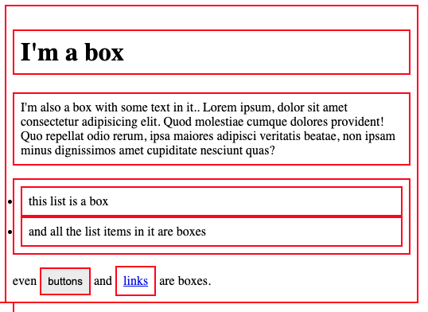
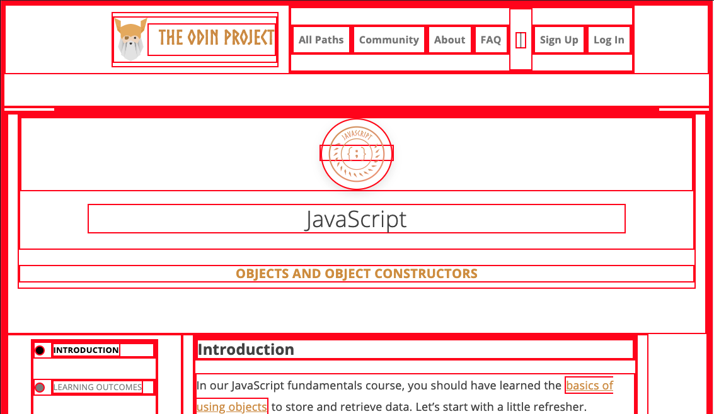
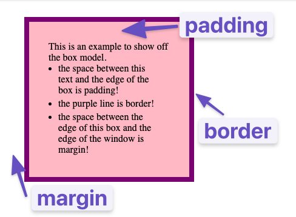

# The Box Model

## Table of Contents

- [Introduction](#introduction)
- [Lesson Overview](#lesson-overview)
- [The Box Model](#the-box-model)
- [Assignment](#assignment)
- [Knowledge Check](#knowledge-check)
- [Additional Resources](#additional-resources)

## Introduction

Now that you understand the basic syntax of HTML and CSS, we’re going to get serious. The most important skills you need to master with CSS are positioning and layout. Changing fonts and colors is a crucial skill, but being able to put things exactly where you want them on a webpage is even more crucial. After all, how many webpages can you find where absolutely every element is just stacked one on top of another?

Learning to position elements on a webpage is not that difficult once you understand just a few key concepts. Unfortunately, many learners race through learning HTML and CSS to get to JavaScript and end up missing these fundamental concepts. This leads to frustration and pain (and funny gifs) because all the JavaScript skills in the world are meaningless if you can’t stick your elements on the page where you need them to be. So with that in mind, let’s get started.

## Lesson Overview

This section contains a general overview of topics that you will learn in this lesson.

- You’ll learn all about the box model.
- You’ll learn how to make sure elements are just the right size with margin, padding, and borders.

---

## The Box Model

The first important concept that you need to understand to be successful in CSS is the box model. It isn’t complicated, but skipping over it now would cause you much frustration down the line.

Every single thing on a webpage is a rectangular box. These boxes can have other boxes in them and can sit alongside one another. You can get a rough idea of how this works by applying an outline to every element on the page like this:

```css
* {
  outline: 2px solid red;
}
```


_Boxes in boxes!_

You can use the browser’s inspector to add the CSS above to this web page if you want, by clicking the + button in the top right of the “Styles” panel within the “Elements” tab. Boxes in boxes!



OK, so there might be some circles in the above image… but when it comes to layout, they fit together like rectangular boxes and not circles. In the end, laying out a webpage and positioning all its elements is deciding how you are going to nest and stack these boxes.

The only real complication here is that there are many ways to manipulate the size of these boxes, and the space between them, using padding, border, and margin. The assigned articles go into more depth on this concept, but to sum it up briefly:

- **padding** increases the space between the border of a box and the content of the box.
- **border** adds space (even if it’s only a pixel or two) between the margin and the padding.
- **margin** increases the space between the borders of a box and the borders of adjacent boxes.

Be sure to study the diagrams carefully.

---

## Box Sizing and the `*` Selector in CSS

By default, the width and height you set for an element in CSS only apply to the content area, not including padding or border. This is called the **content-box** model. Sometimes, this makes layouts harder to manage.

The `box-sizing` property lets you change this behavior:

- `box-sizing: content-box;` (default): Width/height = content only. Padding and border are added outside.
- `box-sizing: border-box;`: Width/height = content + padding + border. This makes sizing elements more predictable.

**Example: Apply to all elements**

You can use the universal selector `*` to set `box-sizing: border-box;` for every element on the page:

```css
* {
  box-sizing: border-box;
}
```

This is a common best practice for easier layout control, as all elements will include padding and border in their width and height calculations.

---

## 

## Assignment

- [Learn CSS Box Model In 8 Minutes](https://www.youtube.com/watch?v=rIO5326FgPE) is a straightforward overview of the box model, padding and margin. Go ahead and watch this now; it informs everything else.
- [box-sizing: border-box (EASY!)](https://www.youtube.com/watch?v=HdZHcFWcAd8) is an add-on to the above resource with a better explanation of ‘box-sizing’.
- Because the box model concept is so incredibly fundamental, let’s dig a bit deeper with [MDN’s lesson on the box model](https://developer.mozilla.org/en-US/docs/Learn/CSS/Building_blocks/The_box_model). It covers the same material as the video(s) above and will introduce you to inline boxes that we will explore in the next lesson. Pay close attention to the examples and take the time to experiment with their in-browser editor!
- The [CSS Tricks page on margins](https://css-tricks.com/almanac/properties/m/margin/) has some further information about the margin property that you’ll find useful. Specifically, the sections about auto and margin collapsing contain things you’ll want to know.

---

## Knowledge Check

The following questions are an opportunity to reflect on key topics in this lesson. If you can’t answer a question, click on it to review the material, but keep in mind you are not expected to memorize or master this knowledge.

- From inside to outside, what is the order of box-model properties?
- What does the box-sizing CSS property do?
- What is the difference between the standard and alternative box model?
- Would you use margin or padding to create more space between 2 elements?
- Would you use margin or padding to create more space between the contents of an element and its border?
- Would you use margin or padding if you wanted two elements to overlap each other?
- How do you set the alternative box model for all of your elements?
- How do you center an element horizontally?

---

## Additional Resources

This section contains helpful links to related content. It isn’t required, so consider it supplemental.

- [Scrim on the box model](https://scrimba.com/scrim/box-model) — For a more interactive explanation and example, try this Scrim on the box model.
- [Kevin Powell](https://www.youtube.com/watch?v=x_i2gga-sYg) - Block, Inline and Inline block
- [Box Model Video Tutorial by Slaying The Dragon](https://www.youtube.com/watch?v=0xMQfnTU6oo) — This informative video tutorial offers a valuable resource for understanding the box model.
